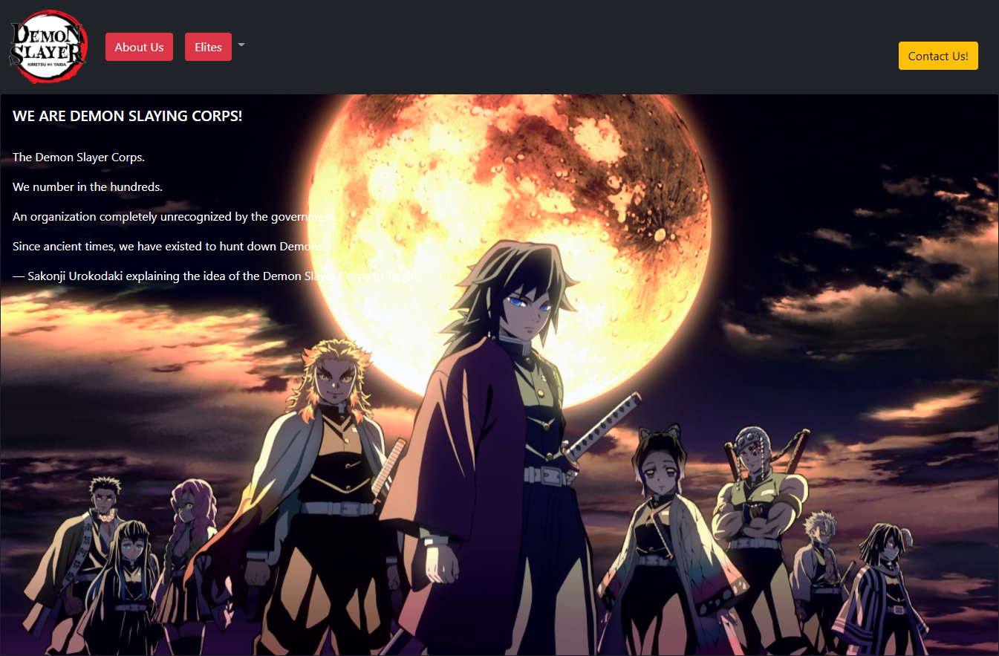
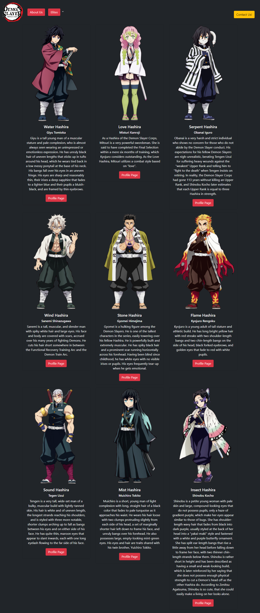

# Project: Responsive Portfolio
## Deployed Link: https://dragontalker.github.io/BootCamp_Project2_ResponsivenessPortfolio/

## Screenshot

## Responsiveness Demonstration

### Desktop Version

### Mobile Version

## Overview

Responsive design ensures that web applications render well on a variety of devices and window or screen sizes. As a developer, you will likely be asked to create a mobile-first application or add responsive design to an existing application. 

First, you will use the Bootstrap CSS Framework to create a mobile responsive portfolio. How do you deliver this? Here are some guidelines:

* Create the following files files: `index.html`, `portfolio.html` and `contact.html`.

* Using Bootstrap, develop your portfolio site with the following items:

   * A navbar

   * A responsive layout

   * Responsive images

* The Bootstrap portfolio should minimize the use of media queries.

* Screenshots are provided as a reference in the `Assets/Images` folder. Your app does not need to be _exactly_ like the images. Use Bootstrap to create a similar, responsive layout.

### Hints

* Use Bootstrap's grid system (containers, rows, and columns).

* On an `xs` screen, content should take up the entire screen. On `sm` and larger screens, you should have some margins on the left and right sides of the screen. Check out various sites on your mobile device vs. your computer to see examples of these differences.

* Use an HTML validation service to ensure that each page has valid HTML.

